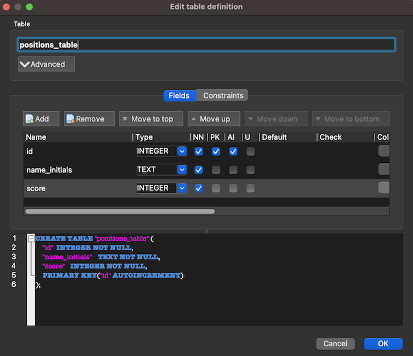

# **El juego: The quest**
<br>
¡¡¡ Espero que disfrutes de éste juego y te pierdas un poco en la inmensidad !!! :D

Desarrollado con Python y utilizando el motor de base de datos SQlite se podrá disfrutar de unos minutos de esparcimiento viajando por el universo en búsqueda de un planeta habitable.<br>
<br>

## ***Instalación***
<br>
La librería utilizada es la de Pygame, se puede dirigir al siguiente link para ver la documentación (https://www.pygame.org/docs/).<br>
<br>

1. En su entorno de Python ejecutar el comando:

    ```
    pip install -r requirements.txt
    ```

2. El motor de base de datos utilizado en el proyecto fue SQLite y para facilidad de uso de este repositorio se dejó base de datos vacía en el mismo, puede ver más información en el siguiente link https://www.sqlite.org/index.html.
<br>
A pesar de lo anterior, para mayor claridad, a continuación se indican algunos puntos importantes en la creación para evitar errores en la ejecución del proyecto: 
<br>

* Se debe crear base de datos con nombre "positions_table.sqlite" en la carpeta "data" de éste repositorio.
    
* La base de datos deberá incluir tabla con nombre "positions_table" y los campos "id, name_initials, score" con las parametrizaciones que se ven en la imagen:

  

<br>

## ***Ejecución del programa***

<br>
Para empezar la aventura ejecutar el comando en consola:

```
python3 main.py
```